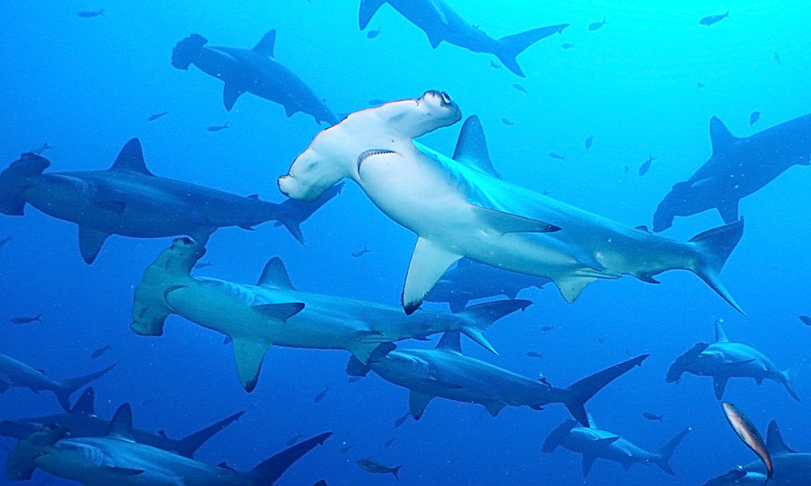

```{r setup, include=FALSE}
knitr::opts_chunk$set(echo = FALSE)
```


 
This project was my master's thesis along with four other team members. The goal of our project was to help the government ensure the long-term persistence of sharks and rays in Mozambique through an expanded network of marine protected areas. We created a reproducible model in R that prioritized areas to protect 26 species of sharks and rays with the least cost to stakeholders. Our project ran scenarios that looked at different fishing pressures on these species and how the reserve design changed based on each stakeholder. 

Learn more at <https://www.future4fins.com/>