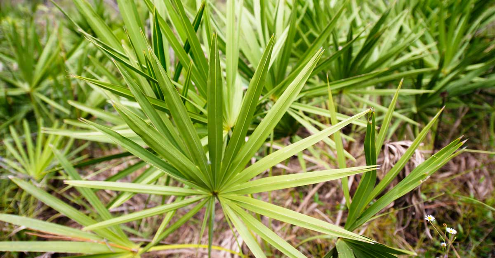

```{r setup, include=FALSE}
knitr::opts_chunk$set(echo = TRUE)
```


```{r}

library(tidyverse)
library(here)
library(GGally)
library(broom)
library(jtools)
library(dplyr)
library(kableExtra)

```

## Task 2 - Palmetto binary logistic regression

Here, we'll be using binary logistic regression to test feasibility of whether a palmetto is species Serenoa repens or Sabal etonia using variables plant height (height), canopy length (length), canopy width (width), and number of green leaves (green_lvs). The data is collected over 5-year intervals between 1981 - 2017 in south-central Florida. This data package used for this analysis is comprised of three datasets all pertaining to two dominant palmetto species at Archbold Biological Station in south-central Florida created by Warren Abrahamson and Bucknell University.

*Data source:* [Abrahamson, W.G. 2019. Survival, growth and biomass estimates of two dominant palmetto species of south-central Florida from 1981 - 2017, ongoing at 5-year intervals ver 1. Environmental Data Initiative](https://doi.org/10.6073/pasta/f2f96ec76fbbd4b9db431c79a770c4d5)



```{r}
# wrangle the data to include only  height, canopy length, canopy width, green leaves. Change species to be names of the species and be read as characters for binary regression. 

palmetto <- read_csv(here("_posts", "2021-02-25-BinaryLogisticRegression", "palmetto.csv")) %>% 
  select(species, length, width, height, green_lvs) %>% 
  mutate(species = case_when(species == 1 ~ "Serenoa repens",
                             species == 2 ~ "Sabal etonia")) 

palmetto$species <- as.factor(palmetto$species)

```

### Data visualization of dominant Palmetto species


Visualize the data and look for trends
```{r, include = FALSE}

# data viz exploration
palmetto %>% 
  ggpairs(aes(color = species))

ggplot(data = palmetto, aes(x = length, y = width)) +
  geom_jitter(aes(color = species)) +
  facet_wrap(~species)

ggplot(data = palmetto, aes(x = height, y = width)) +
  geom_jitter(aes(color = species)) +
  facet_wrap(~species)

ggplot(data = palmetto, aes(x = height, y = green_lvs)) +
  geom_jitter(aes(color = species)) +
  facet_wrap(~species)

ggplot(data = palmetto, aes(x = length, y = green_lvs)) +
  geom_jitter(aes(color = species)) +
  facet_wrap(~species)

```

1. Palmetto Height (cm) vs. Width (cm)

```{r, fig.cap="*Figure 1. Data Vizualization of the canopy height (cm) vs. canopy width (cm) of Palmetto species, Sabal etonia and Serenoa repens. This figure includes all data collected from 1981 to 2017.*"}

ggplot(data = palmetto, aes(x = height, y = width)) +
  geom_jitter(aes(color = species)) +
  facet_wrap(~species) +
  labs(x = "Height (cm)", 
       y = "Width (cm)",
       title = "Canopy height vs. width comparison for Sabal etonia and Serenoa repens",
       subtitle = "1981-2017",
       fill = "Species")
```

- The main takeaway from this figure is that both of these species have similar relationships between the height (cm) vs. the width (cm) and are from a normally distributed sample. 


2. Palmetto Height (cm) vs. Green Leaves (count)
```{r, fig.cap="*Figure 2. Data Vizualization of the canopy height (cm) vs. number of green leaves counted of Palmetto species, Sabal etonia and Serenoa repens. This figure includes all data collected from 1981 to 2017.*"}

ggplot(data = palmetto, aes(x = height, y = green_lvs)) +
  geom_jitter(aes(color = species)) +
  facet_wrap(~species) +
  labs(x = "Height (cm)", 
       y = "Green Leaves (count)",
       title = "Canopy height vs. Green Leaves comparison for Sabal etonia and Serenoa repens",
       subtitle = "1981-2017",
       fill = "Species") +
  scale_fill_manual(values = c("light green", "dark green"))

```

- Overall, the Sabal etonia has fewer green leaves in relation to height, and the Serenoa repens have a higher leaf count even at similar heights to the Sabal etonia.  

### Binary logistic regression
```{r}

#Sabal etonia is 0 and Serenoa repens is 1
#So probability of coefficients being Sabals
palmetto_blr <- glm(species ~ length + width + height + green_lvs, 
                    data = palmetto, 
                    family = "binomial")

#palmetto_blr
#summary(palmetto_blr)

```

##### Binary logisitc regression using plant height, canopy length, canopy width and green leaves as predictor variables to understand how they relate to probability of a plant being Serenoa repens or Sabal etonia. 

**Table 1.** Binary Logistic Regression Model for Palmetto plant species Serenoa repens and Sabal etonia using variables canopy length (cm), canopy width (cm), canopy height (cm) and leaf count. 

```{r}

#make a table df

palmetto_table <- palmetto_blr %>% 
  broom::tidy() %>% 
  select(estimate, std.error, p.value) %>% 
  mutate_if(is.numeric, funs(as.character(signif(.,3)))) %>% 
  slice(-1)

rownames(palmetto_table) <- c("Length (cm)",
                              "Width (cm)",
                              "Height (cm)",
                              "Green Leaves (count)")


#make a kable table

palmetto_kable <- palmetto_table %>%   
  kable(col.names = c("Estimate",
                      "Standard Error",
                      "P value")) %>% 
  kable_styling(bootstrap_options = "striped",
                full_width = F,
                position = "left") %>% 
  add_header_above(c("Table 1. Binary Logistic Regression Model Results" = 4)) %>% 
  row_spec(c(1:4),
           bold = T, 
           color = "grey")

palmetto_kable


```


Main takeaways:
All of the variables in the model had p-values that were < 0.05 with small standard errors. The reference variable in this regression was the Serenoa repens and therefore, this model showed us that with every increase in length (cm), the odds of a sample being a Serenoa repens decreased by -0.05. With every increase in width (cm), the odds of a sample being Serenoa repens decreased by -0.04. With every increase in height (cm), the odds of a sample being Serenoa repens increased 0.3 and with every additional green leaf the odds of a sample being Serenoa repens increased 1.91.


##### Evaluate probability of our model identifying the species correctly. Using the probability of >=50%, the species is Serenoa repens.

**Table 2.** Correct ID probability results for Palmetto plant species Serenoa repens and Sabal etonia.

```{r}

#make a fitted df 
palmetto_fitted <- palmetto_blr %>% 
  broom::augment(type.predict = "response")

palmetto_blr_50 <- palmetto_fitted

palmetto_blr_50$species <- as.character(palmetto_blr_50$species)

#create a table of the probabilities

palmetto_prob_50 <- palmetto_fitted %>% 
  mutate(prob_50 = case_when(.fitted >= .5 ~ "Serenoa repens",
                             .fitted < .5 ~ "Sabal etonia")) %>% 
  mutate(correct = case_when(species == prob_50 ~ "Correct",
                             species != prob_50 ~ "Incorrect"))
  
palmetto_fit_table <- palmetto_prob_50 %>% 
  count(species, correct) %>% 
  pivot_wider(names_from = correct, values_from = n) %>% 
  mutate(total = rowSums(across(where(is.numeric)))) %>% 
  mutate(percent_correct = (Correct/total*100)) %>% 
  mutate(percent_correct = round(percent_correct, digits = 2))

#make a kable table for predictions

palmetto_fit_kable <- palmetto_fit_table %>%   
  kable(col.names = c("Species", 
                      "Correct Prediction", 
                      "Incorrect Prediction", 
                      "Total Count", 
                      "% Correct")) %>% 
  kable_styling(bootstrap_options = "striped",
                full_width = F,
                position = "left") %>% 
  add_header_above(c("Table 2. Probability of Idenitfying Species Correctly" = 5)) %>% 
  row_spec(c(1:2),
           bold = T, 
           color = "grey")

palmetto_fit_kable
```


Main takeaways:
This table shows the number and percent of how accurate our binary logistic model is at predicting the correct species based on our selected variables. Our model was 92.62% accurate for predicting Sabal etonia and 90.77% correct at predicting for Serenoa repens. Overall, the model had similar correct vs. incorrect predictions for both species of palmetto plants and our model was 90%+ accurate for predicting the correct results from a large sample size (over 12,000 observations). This type of model may be useful at predicting these species in a machine learning application based on these results. 